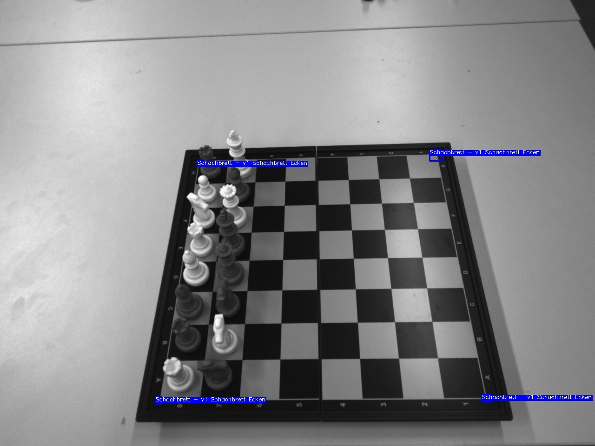
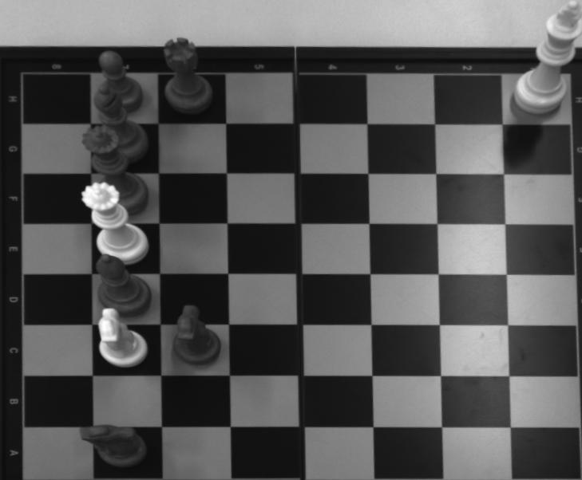
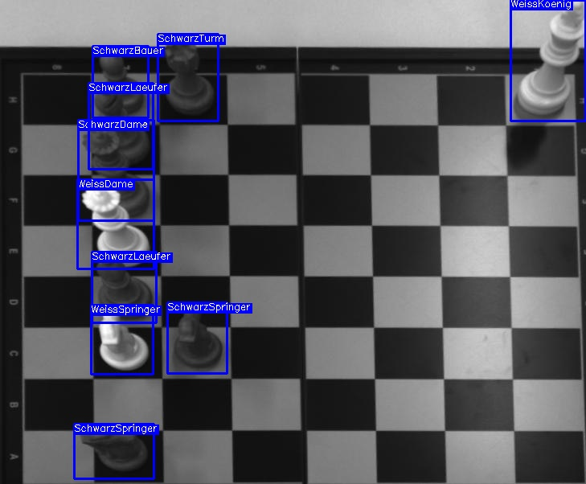
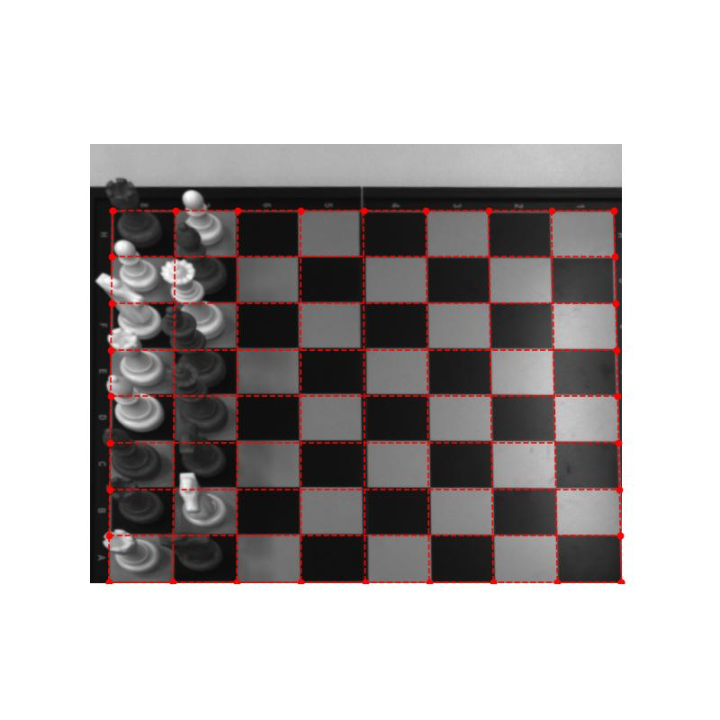

# Chess Playing Robot (using KUKA Robot)
This project entails creating a chess-playing robot using a KUKA robot arm, equipped with machine vision to identify the chessboard and pieces. The system integrates the Stockfish engine for board analysis and move decision-making. This setup allows the robot to autonomously play chess with high accuracy and strategic depth.
## Hardware Requirements
1. KUKA Robot controller (KR C5 micro)
2. rc_visard 3D Stereo Sensor
3. PC for processing Camera data and Handle output to PLC
4. PLC for communication betwee PC and KUKA (KR C5 micro)
## Software Elements
1. ADS communcation for communication between PLC and PC
2. took_photo function for taking new image

2. Machine Vision model for detecting board corners (corner points are updated each 10 games)

3. image processing for clipping the took image 

4. Machine Vision model for detecting the chess figures 

5. mapping all cehess figure to each board square then generating FEN code

6. Handling FEN to stockfish Engine
7. interpreting stockfish output to robot moving orders and sending it to PLC using ADS
